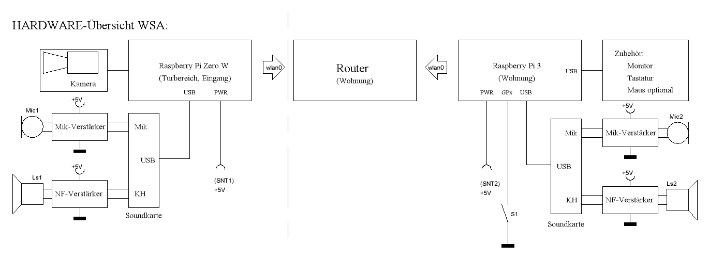

Projekt pi-wsa: Eine Wechselsprechanlage zwischen Pi-Zero-W und Pi3
===================================================================

Dieses Projekt implementiert eine Wechselsprechanlage auf Basis eines
Pi-Zero-W (Tür) und einem Pi3-Desktopsystem.

Das Blockschaubild der beteiligten Komponenten sieht so aus:
.

Softwareseitig besteht dieses Projekt aus den folgenden Komponenten:

  - Dem RTSP-Server
    [v4lrtspserver](https://github.com/mpromonet/v4l2rtspserver "v4lrtspserver")
  - Dem Skript `wsa_start.sh`. Dieses Skript startet den RTSP-Server
    auf dem Pi0 und überträgt Bild und Ton in das Netz
  - Dem `omxplayer` auf dem Pi3 für die Wiedergabe von Bild und Ton
  - Dem Skript `wsa_mic.sh`, welches die Sprechrichtung zwischen
    Tür und Wohnung hin- und herschaltet
  - Dem Skript `wsa_stop.sh`, dass die Übertragung beendet.

Status/Neuigkeiten
------------------

### Version 1, Oktober 2017 ###

Aktuelle, stabile Version.

Voraussetzungen
---------------

Als Vorausetzungen für die Installation werden benötigt:

  - Ein mit Raspbian-Lite installierter Pi-Zero-W. Alternativ kann
    auch ein beliebiger anderer Pi verwendet werden, allerdings ist
    ein Zugang zum lokalen Netz notwendig (i.a.R. WLAN)
  - Ein mit Raspbian-Pixel installierter Pi3. Auch hier ist eine
    Installation auf einem Pi2 möglich, solange dieser Anschluss an das
    lokale Netzwerk erhält.
  - Eine funktionierende Kamera am Pi-Zero
  - Eine Soundkarte mit angeschlossenem Mikro und Lautsprechern an
    beiden Pis.

Auf beiden Systemen sollte Git installiert sein. Falls nicht, installieren
die folgenden beiden Kommandos Git nach:

    sudo apt-get update
    sudo apt-get -y install git

Installation
------------

Die Installation der Projektdateien erfolgt getrennt auf Pi0 und Pi3 mit
den Kommandos (Pi0)

    git clone https://github.com/bablokb/pi-wsa.git
    cd pi-wsa
    sudo tools/install-pi0

beziehungsweise (Pi3):

    git clone https://github.com/bablokb/pi-wsa.git
    cd pi-wsa
    sudo tools/install-pi0

Soll die Wechselsprechanlage automatisch durch den Türgong gestartet werden,
dann muss der Gong an den Pi3 angeschlossen werden. Die Installation der
folgenden Software auf dem Pi3 sorgt dann für den automatischen Start:

    git clone https://github.com/bablokb/gpio-poll-service.git
    cd gpio-poll-service
    sudo tools/install

Das letzte Kommando fordert abschließend dazu auf, die Datei
`/etc/gpio-poll.conf` zu editieren. Das pi-wsa-Projekt bringt
allerdings eine passende Version schon mit. Die einzige notwendige
Anpassung wäre die verwendete GPIO-Nummer.

Für die einfachere Bedienung werden die beiden Skripte `wsa_mic.sh` (Umschalter)
und `wsa_stop.sh` auf Tasten gelegt. Dazu legt die Installation die
Datei `/home/pi/.config/openbox/lxde-rc.wsa.xml` an. Der Inhalt dieser
Datei muss in die Datei `/home/pi/.config/openbox/lxde-rc.xml`
integriert werden. Die einzuarbeitende Datei legt die Kommandos auf die
linke und rechte "Windows"-Taste. Da die linke Windowstaste im Standard
schon belegt ist, muss hier entweder eine andere Taste gewählt oder auf
die Standardfunktion (Öffnen des Menüs) verzichtet werden.

Zertifikate
-----------

Damit vom Pi3 aus Kommandos auf dem Pi0 abgesetzt werden können, müssen
Zertifikate für den User `pi` auf dem Pi3 erstellt und der öffentliche
Teil auf den Pi0 kopiert werden. Die Erstellung erfolgt mit

    ssh-keygen -t rsa

(alle Fragen mit der Eingabetaste beantworten). Das Kommando erzeugt zwei
Dateien:

  - `/home/pi/.ssh/id_rsa` (privater Schlüssel, verbleibt auf dem Pi3)
  - `/home/pi/.ssh/id_rsa.pub` (öffentlicher Schlüssel)

Der öffentliche Schlüssel wird auf den Pi0 kopiert:

    ssh-copy-id -i .ssh/id_rsa.pub pi0

Das letzte Kommando fragt nach dem Passwort des Users `pi` auf dem Host `pi0`.
Nach erfolgreicher Kopie überprüft man den passwortlosen Zugang vom pi3 auf
den pi0 mit

    ssh pi0

Der Befehl sollte sofort ohne Passwortabfrage eine Shell auf dem Host `pi0`
öffnen.

Betrieb
-------

Der Betrieb der WSA funktioniert wie folgt:

  - Der Türgong startet über den *gpio-poll-service* sowohl den RTSP-Server
    auf dem Pi0, also auch den omxplayer auf dem Pi3. Falls der Türgong
    nicht am Pi3 angeschlossen ist, muss der Start manuell über das Skript
    `wsa_start.sh` geschehen.
  - Per Tastatur (Skript `wsa_mic.sh` auf der rechten Windows-Taste) erfolgt
    die wechselseitige Umschaltung der Sprechrichtung.
  - Per Tastatur (Skript `wsa_stop.sh` auf der linken Windows-Taste) erfolgt
    die Abschaltung des RTSP-Servers.
